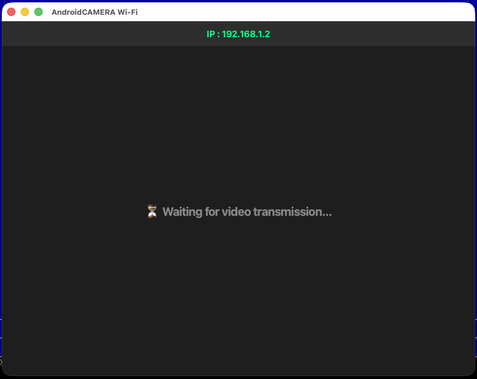

# CameraWifiDesktop
Receive the video from Android; this application is part of the "Camera WiFi" Android app. 

The application was compiled for Windows and macOS; for Linux users, the source code is provided so it can be compiled in that environment.

Executables for macOS and Windows are available in the DesktopApps/ directory. If you wish to run or compile the project on Linux, you can do so using the StreamVideo.py script.